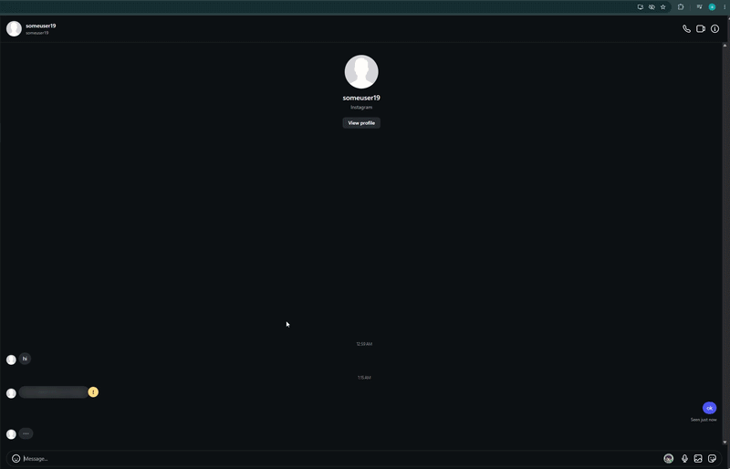
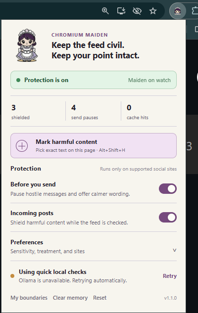
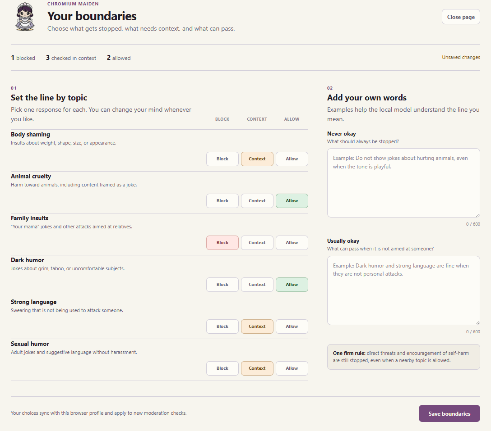
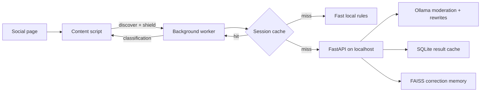

<div align="center">
  
  <h1>Chromium Maiden</h1>
  <p><strong>A calmer feed. A second thought before send.</strong></p>
  <p>Local-first protection for harmful messages on Facebook, Messenger, Instagram, and X.</p>
  <p>
    
    
    
    
  </p>
  <p>
    <a href="#see-it-in-action">Demo</a> ·
    <a href="#what-it-does">Features</a> ·
    <a href="#quick-start">Quick start</a> ·
    <a href="#how-it-works">How it works</a> ·
    <a href="#development">Development</a>
  </p>
</div>

> [!NOTE]
> Chromium Maiden is an active prototype, not an infallible moderation system. It can miss harmful language or flag harmless context, so reveal and override controls always remain available.

## See it in action

Chromium Maiden protects both sides of a conversation—and lets people teach it when the model misses the mark.

### Messages, checked both ways

<p align="center">
  
  <br>
  <sub>Shields harmful incoming content and pauses harmful drafts before they are sent.</sub>
</p>

### Mark what the model missed

<p align="center">
  
  <br>
  <sub>Select exact text, mark it as harmful, and help shield similar content next time.</sub>
</p>

### Protection at a glance

<p align="center">
  
  <br>
  <sub>Session status, protection modes, sensitivity, and active sites.</sub>
</p>

### Your boundaries, your rules

<p align="center">
  
  <br>
  <sub>Block, context-check, or allow topics—and describe the nuance in your own words.</sub>
</p>

## What it does

| | Capability | Experience |
| --- | --- | --- |
| 🛡️ | **Shields incoming content** | Checks posts, comments, and messages near the viewport, then blurs, hides, or warns. |
| ✋ | **Pauses harmful sends** | Intercepts click and keyboard sends without losing the draft or the user's intent. |
| ✍️ | **Suggests better wording** | Offers up to three calmer rewrites with a clear explanation and an explicit override. |
| 🎛️ | **Adapts to personal boundaries** | Lets each user block, context-check, or allow specific topics and add free-form preferences. |
| 🧠 | **Learns local corrections** | Remembers reported false negatives locally through SQLite and FAISS-backed example memory. |
| 🔒 | **Keeps analysis local** | Uses a conservative in-extension fallback and an optional local Ollama backend—no hosted moderation provider. |

## The experience

### Outgoing messages

1. Write normally on a supported social site.
2. After an 850 ms typing pause, Chromium Maiden quietly checks the draft.
3. If the message is harmful, an anchored panel explains why and offers rewrites, **Keep editing**, or **Send anyway**.

If send is pressed while a check is still running, one send intent is held. A safe result from the deeper local model completes it; quick fallback results always require another user action.

### Incoming messages

1. Content close to the viewport enters a subtle pending shield.
2. Safe content is revealed; harmful content receives the configured treatment.
3. A compact warning menu can reveal the original, provide a calmer reading, or record a correction.

When the model misses harmful text, select it and use **Chromium Maiden: shield similar text next time** from the browser context menu.

## Quick start

### 1. Load the extension

1. Open `chrome://extensions`.
2. Enable **Developer mode**.
3. Select **Load unpacked**.
4. Choose the [`extension`](extension) directory.
5. Reload any already-open Facebook, Instagram, or X tab.

The extension works immediately with its conservative local fallback. Start the optional backend for contextual classification and generated rewrites.

### 2. Run the local backend

Requirements: Python 3.10+, [Ollama](https://ollama.com/), and Node.js 18+ for JavaScript checks.

```bash
python -m venv .venv
```

<details>
<summary><strong>Install dependencies on Windows PowerShell</strong></summary>

```powershell
.\.venv\Scripts\Activate.ps1
pip install -r backendv2\requirements.txt
```

</details>

<details>
<summary><strong>Install dependencies on macOS or Linux</strong></summary>

```bash
source .venv/bin/activate
pip install -r backendv2/requirements.txt
```

</details>

Download the models and start the API:

```bash
ollama pull qwen2.5:3b
ollama pull nomic-embed-text
uvicorn backendv2.main:app --host 127.0.0.1 --port 8000 --reload
```

Verify the service at `http://127.0.0.1:8000/health`. The extension popup will report **Local model connected**.

<details>
<summary><strong>RTX 50-series note for Windows</strong></summary>

Start Ollama with the bundled CUDA 13 runner before starting the API:

```powershell
.\scripts\start-ollama-gpu.ps1
```

Add `-DebugLogs` when diagnosing automatic discovery. After the first request, `ollama ps` should report `100% GPU` in its processor column.

</details>

### 3. Personalize your boundaries

Open the extension popup, select **My boundaries**, choose **Block**, **Context**, or **Allow** for each topic, and add any nuance in your own words. New moderation checks immediately use the saved profile.

## How it works



The content script prioritizes visible content and rejects stale results when a reused DOM node has changed. The background worker deduplicates identical in-flight requests, runs up to three uncached checks concurrently, and keeps a 400-entry session cache with a 30-minute TTL. If the backend becomes unavailable, a circuit breaker switches to the fast local fallback and retries automatically.

### Supported sites

- Facebook and Messenger
- Instagram
- X and legacy Twitter URLs

Social sites change their DOM frequently, so selector maintenance is expected and coverage can differ across feeds, comments, and direct messages.

## Settings

| Setting | Effect |
| --- | --- |
| Before you send | Checks drafts and pauses harmful send actions. |
| Incoming posts | Checks visible incoming content. |
| Sensitivity | Relaxed raises the intervention threshold; Strict lowers it. |
| Incoming treatment | Blur, hide, or warn without obscuring the content. |
| Active sites | Enables protection independently for Facebook, Instagram, and X. |
| My boundaries | Blocks, context-checks, or allows six topics plus two free-form preference descriptions. |

Settings sync through `chrome.storage.sync`. Moderation results remain in `chrome.storage.session` and expire after 30 minutes. Direct threats and encouragement of self-harm stay blocked even when a nearby topic is allowed.

## Privacy by design

- Social content is analyzed inside the extension or sent to the local API at `127.0.0.1`.
- The default backend uses local Ollama models and does not call a hosted moderation provider.
- Classification results are cached locally to avoid repeated work.
- Reported examples are stored locally in SQLite and FAISS only after an explicit report.
- There is no analytics or telemetry integration.

Any future hosted model integration would change this privacy boundary and must be disclosed in both the product and its documentation.

## Development

```bash
npm test          # JavaScript queue, DOM, fallback, and send-intent tests
npm run check:js  # Syntax-check every extension script
npm run test:python
npm run check     # Run all available checks
```

<details>
<summary><strong>Project structure</strong></summary>

```text
chromium-maiden/
├── backendv2/                 FastAPI, Ollama, SQLite, and FAISS backend
│   ├── memory/                Persistent moderation cache and hashing
│   ├── models/                API request and response schemas
│   ├── rag/                   Embeddings and adaptive vector memory
│   └── routes/                Incoming, outgoing, and reporting endpoints
├── docs/media/                README screenshots, video posters, and upload guide
├── extension/
│   ├── mascots/default_maid/  Maiden states used by the interface
│   ├── utils/                 DOM discovery, API bridge, queue, and cache
│   ├── background.js          Moderation service worker
│   ├── contentScript.js       Incoming and outgoing page behavior
│   ├── content.css            Isolated page interventions
│   ├── boundaries.*           Personal tolerance preferences
│   └── popup.*                Toolbar controls and session status
├── tests/                     JavaScript and Python regression tests
├── DESIGN.md                  Visual system and component rules
└── PRODUCT.md                 Product purpose and experience principles
```

</details>

<details>
<summary><strong>Local API</strong></summary>

| Method | Endpoint | Purpose |
| --- | --- | --- |
| `GET` | `/health` | Check backend availability. |
| `POST` | `/monitor/incoming` | Classify incoming content. |
| `POST` | `/monitor/outgoing` | Classify a draft and return rewrite options. |
| `POST` | `/report/content` | Add a reported example to SQLite and FAISS memory. |

Incoming responses skip rewrite generation to reduce latency. Outgoing responses generate up to three alternatives when the score warrants intervention.

</details>

## Known limitations

- Detection is probabilistic and context-sensitive; false positives and false negatives are unavoidable.
- A slow first model request can keep safe incoming text softly blurred for longer than usual.
- The first Ollama request may be slower while a model loads into memory.
- The fast fallback covers a conservative set of explicit English phrases.
- Changes to social-site markup can break individual selectors.
- Some sites may reject synthetic send actions after changing their composer implementation.
- Session metrics reset when the extension service worker restarts.

## Roadmap

- Fixture-based DOM coverage for every supported site
- Language-aware fallback models and multilingual evaluation sets
- Batched classification for nearby incoming messages
- Time-to-shield, cache-hit, and selector-coverage measurements without collecting message content
- Repeatable Chrome Web Store release checks and a privacy policy

## Contributing

Keep changes focused and testable. Selector changes should include their target page context and, when possible, a sanitized DOM fixture. Moderation threshold or prompt changes should document the evaluation examples behind them.

See [`DESIGN.md`](DESIGN.md) for interface rules and [`PRODUCT.md`](PRODUCT.md) for product principles.

<div align="center">
  
   <br>
  
</div>
